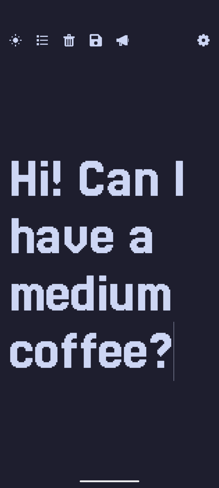
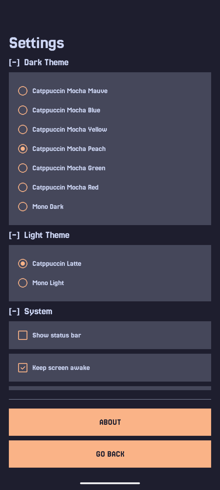
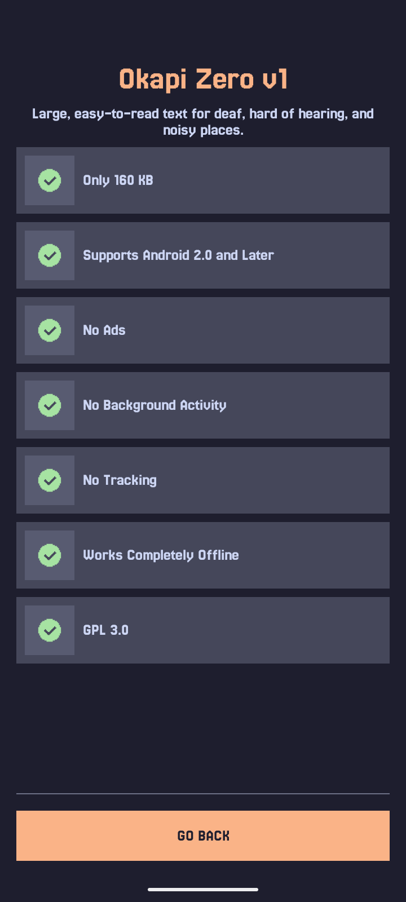

# Okapi Zero

**Show your message instead of shouting it.**

Designed to make one-on-one conversations easier for deaf and hard-of-hearing people, and anyone talking in loud or noisy places. Type a message, tap the megaphone, and it fills the screen.

| Home | Settings | About |
| - | - | - |
|  |  |  |

Designed to support Android API 5 (Android 2.0) through the latest Android versions, with a focus on broad compatibility and long-term stability.

---

## Features

- **Large, self-sizing text**: Type your message and it automatically grows to fill the screen,
  wrapping across multiple lines if needed, without ever shrinking below 50sp, so it stays
  readable from across a table.
- **Saved messages**: Reuse phrases you've typed before instead of retyping them. Tap "Add
  Message" to start a new one, or tap any saved message to bring it back up.
- **Manual reordering**: Tap the sort icon on the home screen to reveal up/down arrows next to each saved
  message and arrange them in whatever order makes sense to you.
- **Light/dark accessibility toggle**: Switch instantly between a light and a dark theme. Handy
  for reading outdoors on a sunny day versus in a dim indoor conversation. Both themes can be choose in Settings.
- **Quick clear**: Double-tap the message while editing to instantly clear it and start over
  (can be turned off in Settings).

---

## Installation

  
  &nbsp;
  

